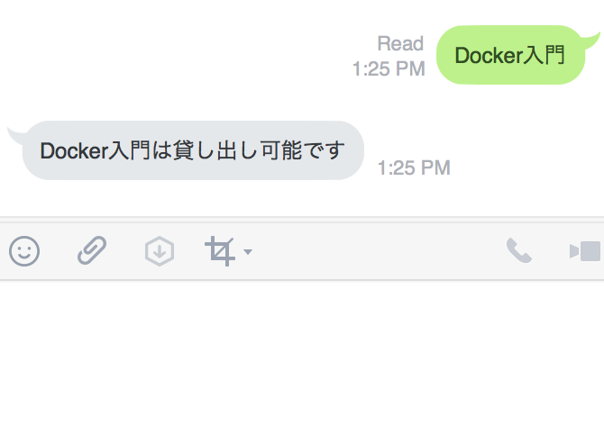

# library-api

 This app is library-api for using often library and project of ACL. ACL stands for **Aizu Circle Learning** and this activity make our programing skill up.
 
<br>

## Description

You can search state you want to borrow from library using interface of LINE. 
like this...



<br>

## Equipments
- Go
- JavaScript
- Vue.js (FrameWork)
- MySQL (databese)
- ngrok (Secure tunnels to localhost)

<br>

## Installation
You need install this libraries

```sh
$ go get github.com/line/line-bot-sdk-go
```
```sh
$ go get github.com/go-sql-driver/mysql
```
```sh
$ go get github.com/gocraft/dbr
```
```sh
$ go get github.com/labstack/echo
```
& echo's subpackage middleware also

<br>

## Starting of this app

```sh
$ pwd library-api
$ npm run dev
$ cd .backend
$ ./backend
$ cd ../client
$ ./client
$ cd ..
$ ngrok http 8888
```

so, you just have to work 4 like this.
